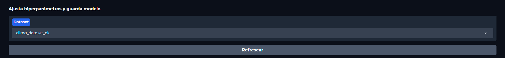

# AI-Mini-Trainer

MOTIVACIÓN: Esta aplicación surge como apoyo a los conocimientos de Machine Learning recientemente adquiridos. 

PROPÓSITO: Pretende simplificar los procesos de entrenamiento de distintos modelos de ML clásicos, permitiendo configurar o ajustar parámetros propios y específicos de cada uno de ellos así como facilitar las pruebas de predicción.

# Uso de la herramienta

La herramienta divide su funcionalidad en 3 pestañas:

- La primera pestaña permite cargar un dataset personalizado o probar con varios de los que ofrece sklearn por defecto

- Sobre el dataset cargado por nosotros o seleccionado se comprueba que modelos son compatibles y permite multiselección de ellos para hacer una prueba inicial de precisión y comparar entre ellos.

- Una vez comparados los resultados podemos realizar un entrenamiento más específico en la pestaña 'Entrenamiento'

- En ella seleccionaremos nuevamente un dataset. Si hemos subido un dataset y no aparece en el listado hay que pulsar en el borón  'Refrescar'. 

- Una vez ajustados los parámetros específicos y entrenado el modelo (visualizando resultados)

- podemos guardar el modelo con un nombre personalizado.

- A contiunuación en la pestaña de 'Predicción' podremos usar el modelo para hacer una prueba definitiva

- En la pestaña de predicción con el modelo seleccionado elegimos si queremos hacer una previsión aportando datos para un caso individual o queremos cargar un conjunto de datos

- Podremos exportar una plantilla para rellenarla con datos y cargarla para hacer predicciones y pruebas

